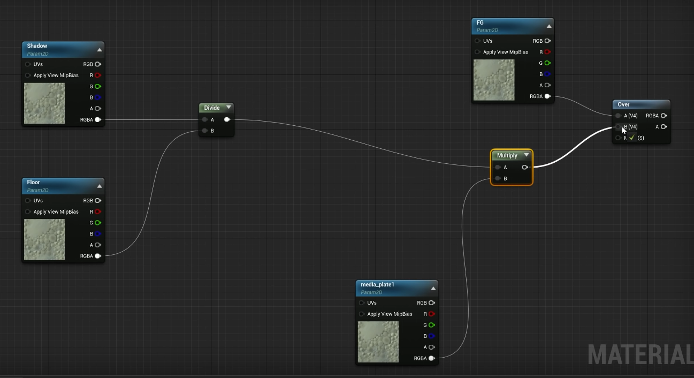

  * # Easy
    * enable image plate in addons
    * add image plate to scene
    * drag and drop image plate onto camera
    * under advanced setting you can select material
    * create a new material swith shading mode - unlit, two-sided enabled
  * # Compositing
    * enable composure plugin
    * project settings -> enable alpha channel support ->linear color space only
    * window -> virtual production -> composure compositing
    * create new comp
    * right click add elements -> media plate
    * media source - texture input
    * drag your backplane into the slot
    * new element - cg layer FG
    * window - enable layers
    * grab foreground elements and add them to FG layer
    * create a plane under the object
    * add floor items, add items that will cast a shadow to shadow layer
    * add new elements to composure - floor and shadow
    * under composure FG element - > Composure -> input -> capture actors +
    * include FG
    * same for floor and shadow
    * create new material -> edit
    * change to post process material
    * 
    * connect this to emissive
    * select main comp
    * add transform pass
    * add new material in that material slot
  * # HDRI
    * drag and drop hdr into content browser (only works with .HDR)
    * double click - max texture size - (to bigger number of the image)
    * mip gen settings - no mipmaps
    * add new item -> lights ->hdri backdrop
    * choose your image
    * scene black? hdri backdrop size to 500+
  * # Hide hdr background but leave reflections
    * add Skylight -> Source type Cubemap
    * select hdr
    * Geometry -> search for visible and turn off
    * [https://www.youtube.com/watch?v=Reu26Jzyy4g](https://www.youtube.com/watch?v=Reu26Jzyy4g)
  * # Shadow caster
    * create an object that will occlude but not be visible
    * go to settings of the object under rendering section
    * uncheck render in main and depth pass