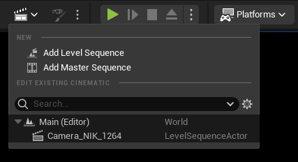
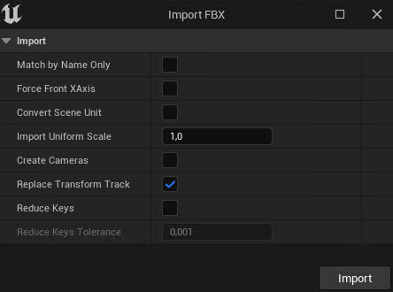

* # Import camera
    * export camera from blender with fbx (must have at least 1 key-frame - press I in the layout) baking animation
    * create a camera in UE
    * add a sequence
    * 
    * right click sequencer
    * add actor to sequence -> camera from above
    * right click camera track -> import
    * 
* # Camera shake
    * create blueprint class - camera shake base
    * double click - perlin noise
    * timing duration - 0 entire shot
    * compile and go to sequencer
	    * select camera and track+ -> camera shake
* # Camera rail
	* Add camera rail
	* parent whatever you want under the rail
	* select rail and animate the parameter Current position on rail