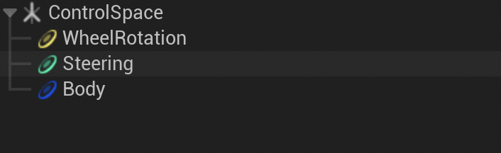
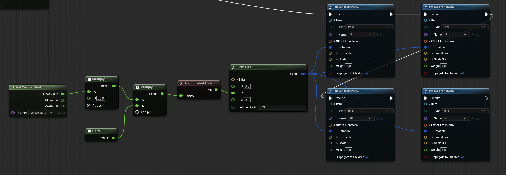
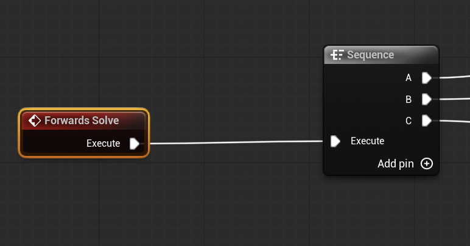
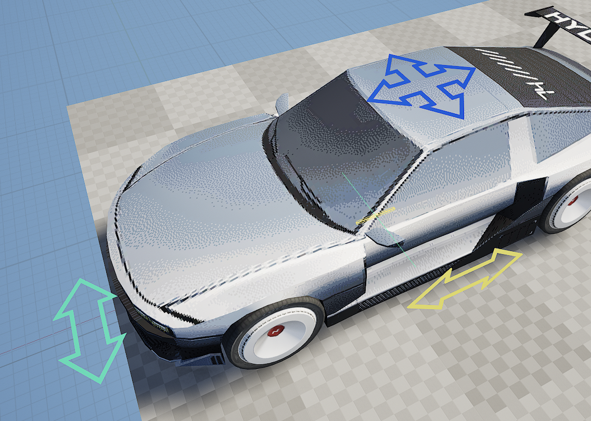

# Blender part
- Blender automatic rig
https://continuebreak.gumroad.com/l/uYsaQ
# UE
- ### Base
	- import FBX - skeletal mesh -checked
	- open physics asset and select all wheels
	- change type to sphere
	- regenerate all
	- you can try to make a multi convex body for the body but it crashes
- ### Control rig
	- Rightclick on skeletal mesh - create - control rig (or just press add in content browser and choose control rig then in the hierarchy on bottom left you can import the skeletal mesh)
	- there is a hierarchy window on bottom left
	- right click in window - new - control (this is the controller for body animation in viewport)
	- do the same for rear wheels and front steering
	- **deselect everything** then right click on empty space new - null, rename to ControlSpace (this is just a group for your controls)
	- select all controllers and put them under control space
	- 
- ### Nodes
	- Body
		- Drag body control in - get control
		- Drag root of bones in - add offset
		- ![[Pasted image 20251220173924.png]]
	- Steering
		- drag in steering - get control
		- drag in front wheels - offset
		- if the wheels are not straight make sure the offset on the right menu is 0 0 0
		- ![[Pasted image 20251220173903.png]]
	- WheelRotation
		- 
	- Sequence
		- the controls have to be in certain order - body, steering, rotation
		- use sequence node to execute them
		- 
      * UI
        * in control rig setting you can select each control and change it's color shape and so on to see them in viewport
        * 
        * you can limit how much you can steer or rotate or whatever in the same menus
	* Animation
		* go into Animation mode (where landscape, mesh editing, foliage are)
		* attach control rig to [[Camera_Rail]] and animate position
* ### Problems
	* **Anim outliner empty**
		* if in animation mode the outliner on the right is empty and you see no controls then go to sequencer where you have your control rig actor added and click on the small + next to it. Select control rig - pick the one you made