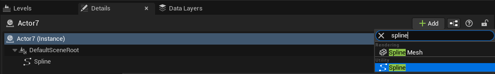
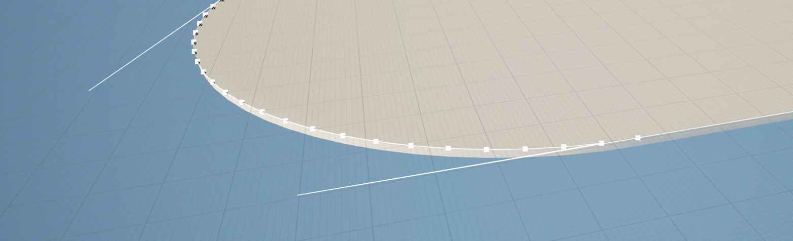

* ## Steps
    * **Blender**
      * Select and edge loop in blender and separate it, convert to curve
      * Paste the script and execute, it will create a json file in the blender file location
    * **Folders and files**
      * by default it will look in C:/tmp/ folder for **selected_splines.json**
    * **Unreal**
      * create an actor
      * in details panel add spline component
      - run the script
* ## Problems
	- for some reason it gives some crazy tangents on corners
	- 
      * if you select the problematic point and press shift+T it should be fine
## Resources
### Script for blender output to json
```
import bpy
import json
output_data = {}
for obj in bpy.context.selected_objects:
    if obj.type == 'CURVE':
        splines = []
        for spline in obj.data.splines:
            points = []
            if spline.type == 'BEZIER':
                for p in spline.bezier_points:
                    co = obj.matrix_world @ p.co
                    points.append({"x": co.x, "y": co.y, "z": co.z})
            else:
                for p in spline.points:
                    co = obj.matrix_world @ p.co.xyz
                    points.append({"x": co.x, "y": co.y, "z": co.z})
            splines.append({
                "type": spline.type,
                "cyclic": spline.use_cyclic_u,
                "points": points
            })
        output_data[obj.name] = splines
# Save JSON
output_path = bpy.path.abspath("C:/tmp/selected_splines.json")
with open(output_path, 'w') as f:
    json.dump(output_data, f, indent=4)
print(f"Exported splines from {len(output_data)} object(s) to {output_path}")
```
- select curve and it will export to the same folder as blender file
### Script to create a spline based on json
```
import unreal
# Get the selected Spline Actor
selected = unreal.EditorLevelLibrary.get_selected_level_actors()
if not selected:
    raise RuntimeError("No actor selected!")
# Ensure it's a Spline Actor
spline_actor = None
for actor in selected:
    spline = actor.get_component_by_class(unreal.SplineComponent)
    if spline:
        spline_actor = actor
        break
if not spline_actor:
    raise RuntimeError("No selected actor has a SplineComponent.")
spline_comp = spline_actor.get_component_by_class(unreal.SplineComponent)
# Example: load points from JSON
import json
json_path = r"C:/tmp/selected_splines.json"
with open(json_path, "r") as f:
    data = json.load(f)
spline_name = list(data.keys())[0]
points = data[spline_name][0]["points"]
# Clear existing points
spline_comp.modify()  # mark as transactional so it stays editable
spline_comp.clear_spline_points()
# Add points with scaling and flipping
for idx, pt in enumerate(points):
    loc = unreal.Vector(
        pt["x"] * -100,   # Flip X and scale
        pt["y"] * 100,    # Scale Y
        pt["z"] * 100     # Scale Z
    )
    spline_comp.add_spline_point(loc, unreal.SplineCoordinateSpace.LOCAL, False)
spline_comp.set_closed_loop(False, False)
spline_comp.update_spline()
unreal.log("Spline updated successfully with scaling and flipping. You can now edit it manually.")
```
### Example of json
- [selected_splines.json](selected_splines_1752250058197_0.json)