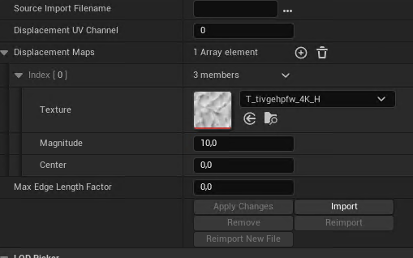

  * Open **Edit > Project Settings**.
  * Navigate to **Platforms > Windows**:
  * Set **Default RHI** to **DirectX 12**
  * Under **Engine > Rendering > Hardware Ray Tracing**, enable:
  * **Support Hardware Ray Tracing**
  * **Enable Path Tracing**
  * Now every mesh with nanite and proper displacement node will be tesselated in viewport
  * For Pathtracing you have to assing a displacement map per mesh and set it's magnitude
  * 