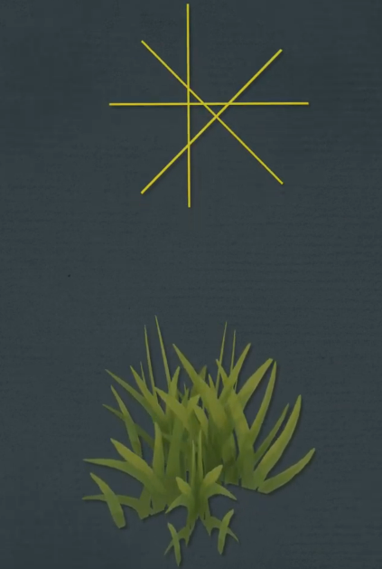
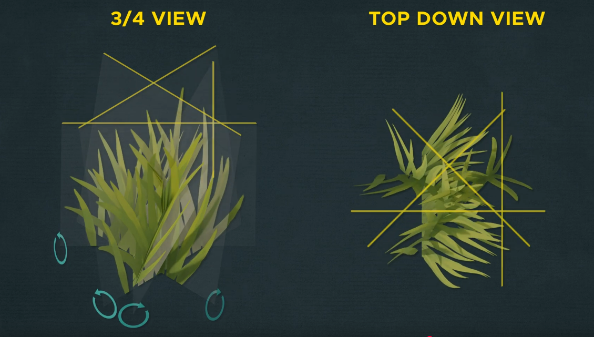
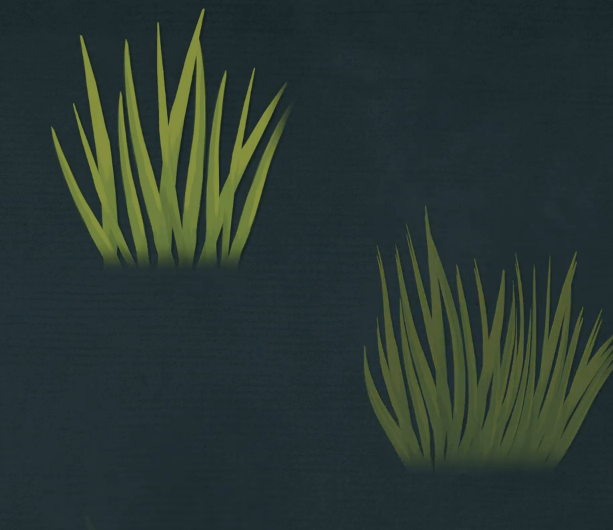

  * # Billboards
    * Offset center
      * 
    * Scale planes differently
    * Twist planes
      * 
    * Make a bottom gradient
      * 
  * # PCG
    * if you have the grass from fab then
    * enable nanite, preserve area and apply
    * LOD set to 1
    * got to material and opacity texture node
    * change mip value mode to miplevel