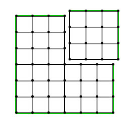
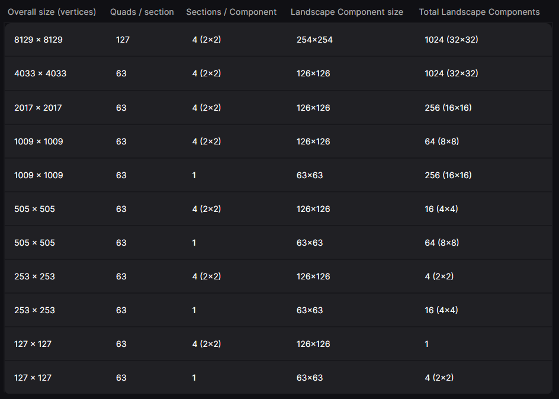
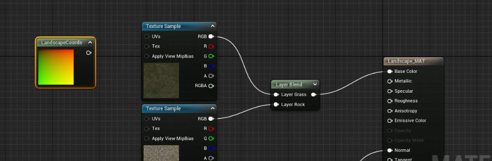
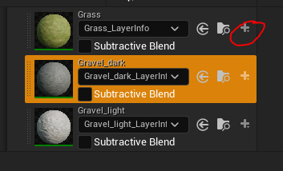

  * # General
    * go into landscape mode and create a new landscape
    * If you import a heightmap, it needs to match one of the "power-of-two-plus-one" sizes (e.g., 1009×1009, 2017×2017, 4033×4033, 8129×8129).
    * One quad = **1 Unreal Unit** by default, and 1 UU = 1 cm. So a 4033×4033 landscape = 40.33m x 40.33m *per 100 quads = ~4km x 4km*.
  * # How it works
    * Landscape is divided into **Components** (light green)
    * Components are divided into **Sections** (medium green)
    * Here are 4 components with 9 sections each (3x3)
    * 
    * Each section is a draw call and is rendered by CPU
    * The largest landscapes should have a **maximum of 1024 components**
    * ## **Sections size is higher -> it will cover more area -> lower polycount**
    * 
  * # Material
    * Automaterial
      * https://ko-fi.com/s/8e038bb081
    * Simple_paint
      * 
* for every layer there has to be an index
* UVs node has to be attached to have proper tiling (can change scale in it's parameters)
* select the landscape mesh and assign the material in the properties on the right, like any other mesh
* before starting to paint create layer infos 
  * # Randomize tiling
    * [https://www.youtube.com/watch?v=NJ91s4KOTUw](https://www.youtube.com/watch?v=NJ91s4KOTUw)
    * in the first texture sample search macro
    * make material attributes?
    * 
    * 
  * # Copy landscape
    * to resize or copy you can use a gizmo that will store all the info
    * go to landscape mode - manage
    * select - select all stuff you want to copy
    * go to sculpt - copy - fit gizmo to selected regions - copy data to gizmo
    * now you can modify the landscape however you want
    * if you want to paste it to modified landscape just press ctrl+v
  * # Modify Landscape to spline
    * Static
      * create landscape
      * go to landscape manage section
      * click spline icon on the right
      * ctrl+lmb in the viewport
      * click all splines in tool settings
    * Dynamic
      * all the same but don't click on all splines
      * add another layer with the plus sign
      * landscape edit layer splines
      * you can sculpt the bottom layer
    * You can place meshes on this spline - road segments
  * # Black landscape
    * create weights for all layer under landscape mode - paint
    * of still black select automaterial and paint the whole landscape