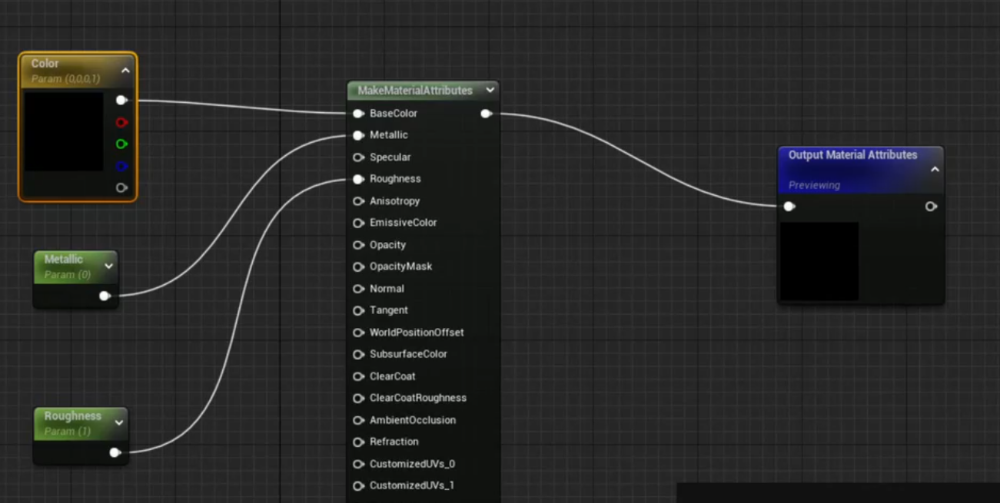
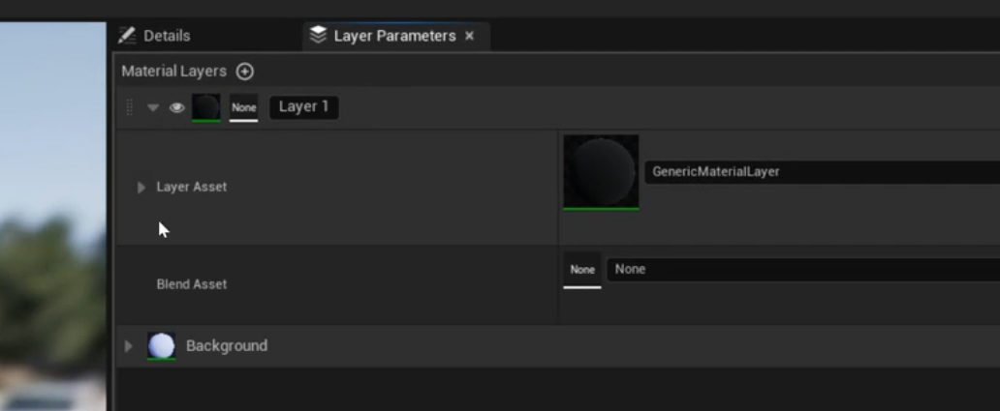
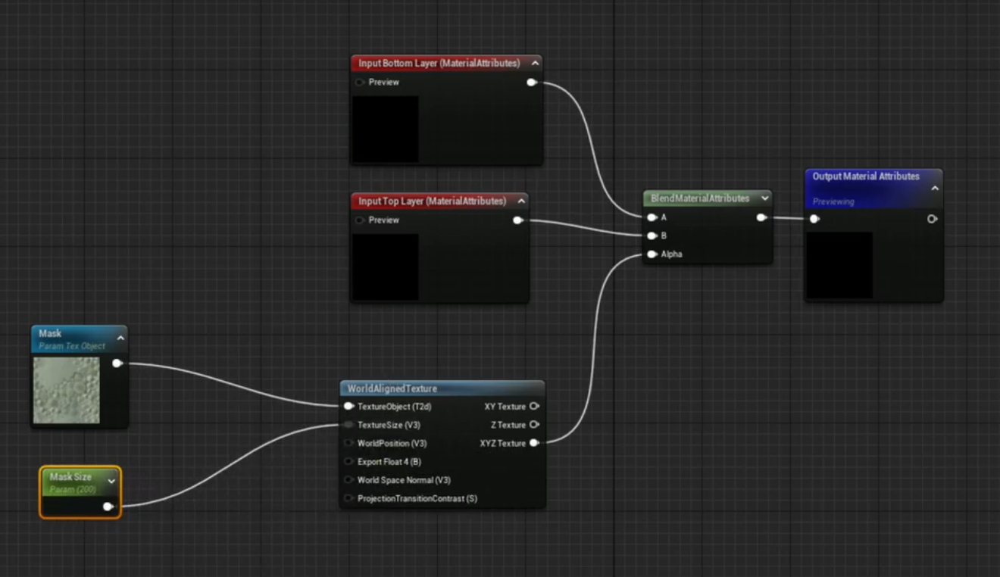
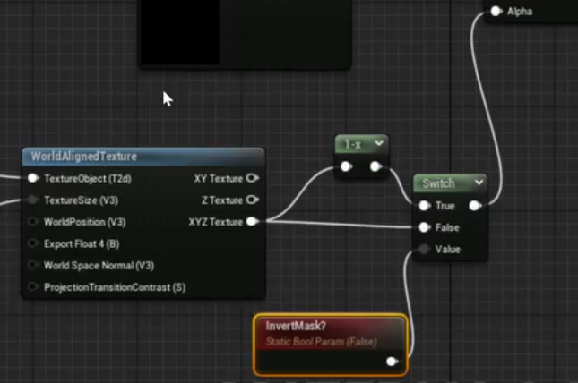

  * # Base
    * create a new folder called Layered_materials
    * right click in contents browser - create material
    * Name M_IY_layered_base_material
    * use material attributes ✅ (will pass through all the layers we have)
    * right click - get material attributes
    * add Material attribute layers
  * # Material instance
    * create a new material "M_IY_layered_material_instance"
    * for parent choose layered base material
    * on the layer parameters tab you are going to see exposed parameters from below
  * # Material layer
    * create a new material "M_IY_generic_material_layer"
    * add makematerialattributes
    * 
    * click the tiny arrow to make a parameter
    * use group under material expression to structure parameters
  * # Material Blend
    * go back to the layer parameters tab in layered material
    * add a material layer
    * 
    * go back to content browser add a new material - material layer blend (M_IY_material_blend_triplanar)
    * 
    * mask is a noise pattern
    * mask size is in meters (make a parameter)
    * now go to M_IY_generic_material_layer
    * and under layer parameters add a blend asset M_IY_material_blend_triplanar
    * now you can switch masks and add more layers with different colors
  * # Tips
    * invert mask
    * 