# General
- O - Occlusion (RED)
- R - Roughness (GREEN)
- Dp - Displacement (BLUE)
* texture sample - texture input
* you can adjust brightness of textures in their settings
* brightness/contrast is done with 3pointlevels
* invert node - oneminus
* uv scale
* 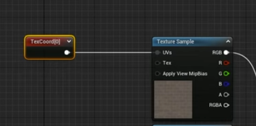
# Material instancing
- 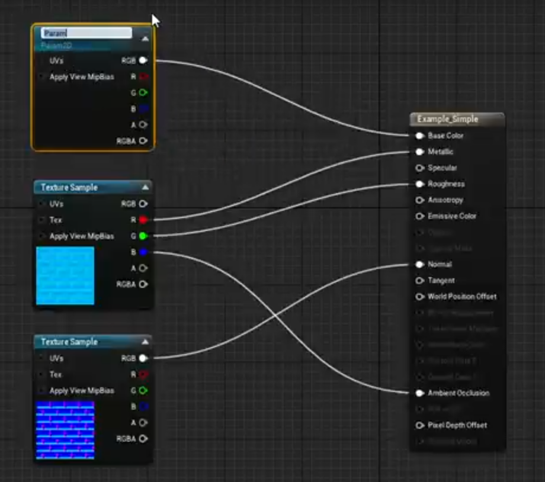
- A generic shader for UE5 to have material instances
- right click a node and convert to parameter (color, normal, roughness)
- in details of the sample it has to say Sampler type: diffuse - color, roughness - masks, Normal - normal
- now if you create a material instance and select you material as parent you will have access to exposed parameters
# Brightness saturation contrast
- Material function call node (comes from fab/material functions)
- 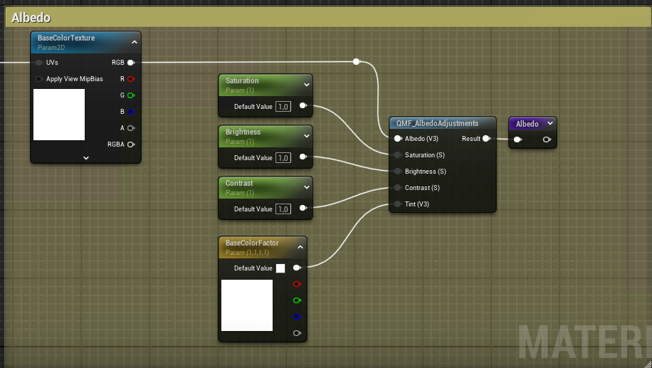
## Blend screen and others
- 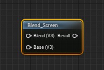
## Replace material
- 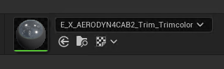
* find material with magnifying glass
* right click - asset actions select all actors
## Normals
- flip normal
- 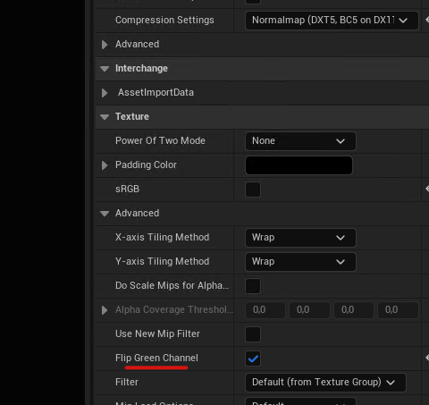
- normal scale
- 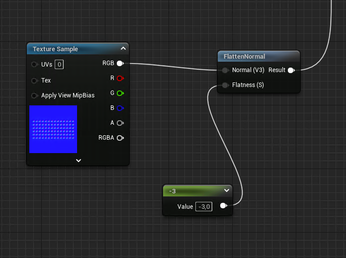
## Displacement
- 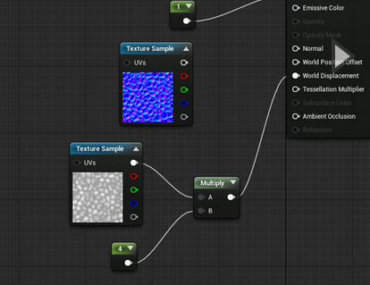
## Overlay
- 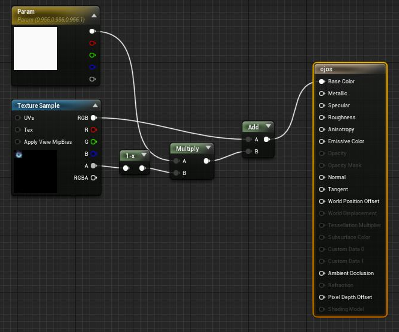
## U and V parameters
- 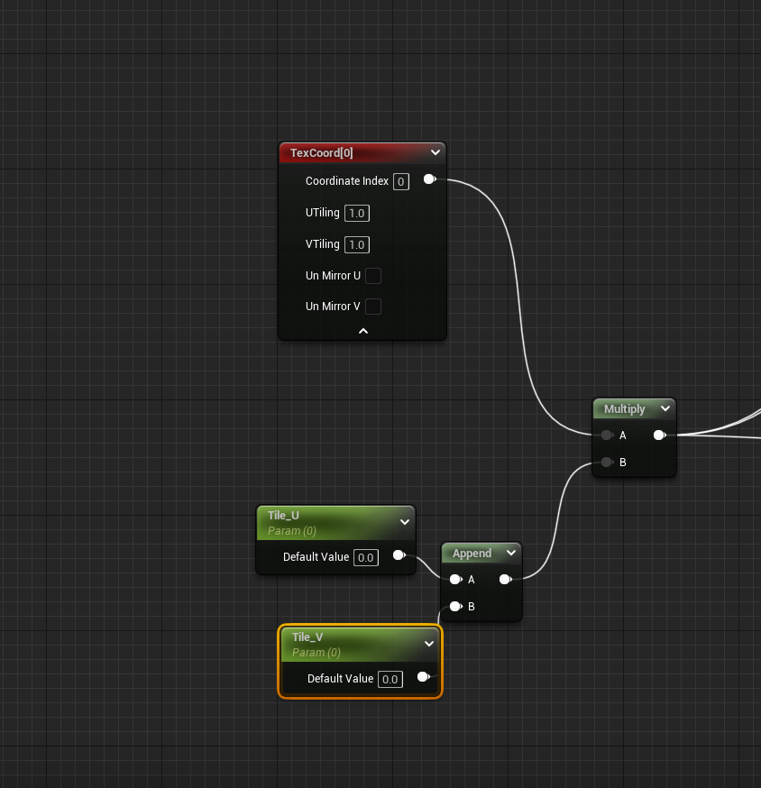
## Material layers
- create a material function
- add make material attributes
- create master material and scroll down on the left
- check use material attributes
- use matlayerblendsimple for blending things
- drag in the material functions
- material functions for landscape
- 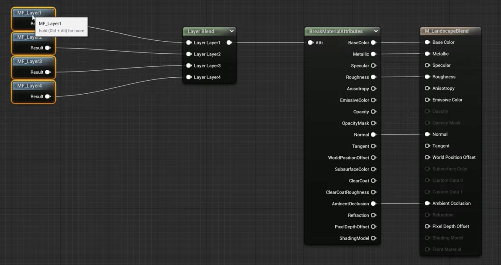
## Sprite (simple)
- or imposter is set up in the material
- 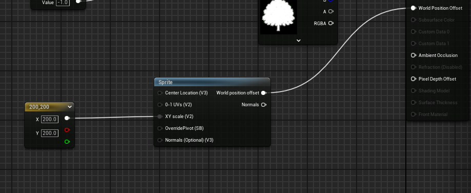
- control offsets with folliage
# Tiling
- [M_IY_random_tiling.uasset](M_IY_random_tiling_1745167343646_0.uasset)
# Substance masks
- 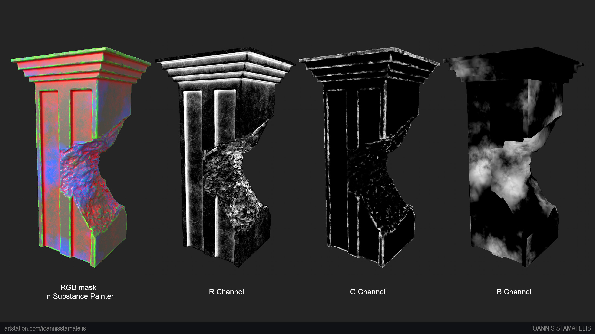
- 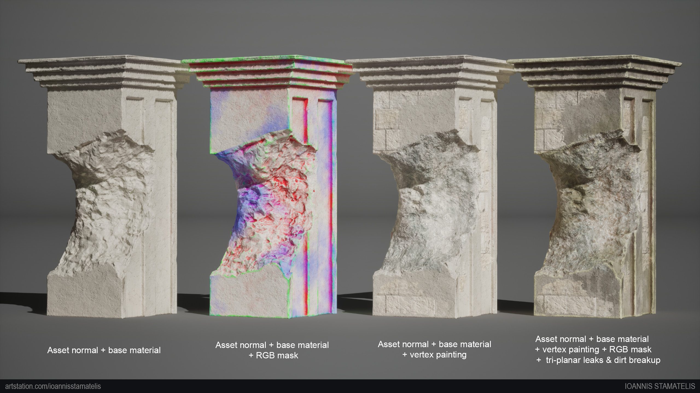
-  https://www.artstation.com/artwork/3E8Oag
# Substance to UE
- ORM
- disable srgb
- compression settings to masks
- sampler type to mask
# Vertex painting
## Basics
-  Just paint some color and then it will take all the vertex paint data and convert it to values
- [image.png](image_1742124014923_0.png)
## Noobsus
- Lerp is blending between two colors based on the red channel of vertex paint
- 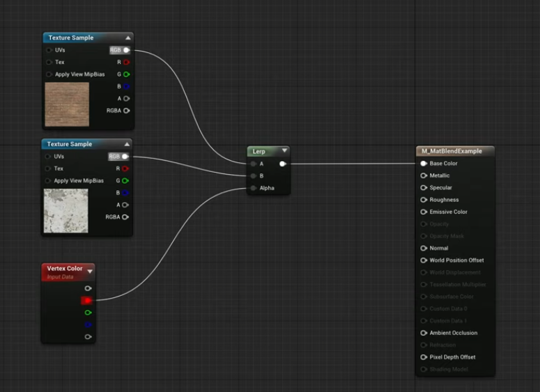
## Easy
- Plug in the height map into lerp and vertex color is going to paint only on high points
- Contrast can be adjusted for sharper painting
- 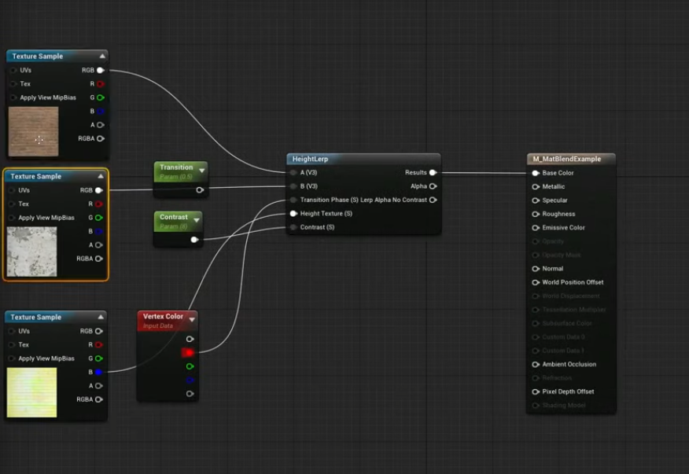
## Medium
- so you make 2 materials and then paint between them
- click on the material node and enable material attributes on the left
- add make material attributes node
- instead of lerp you need blendmaterials attributes
- 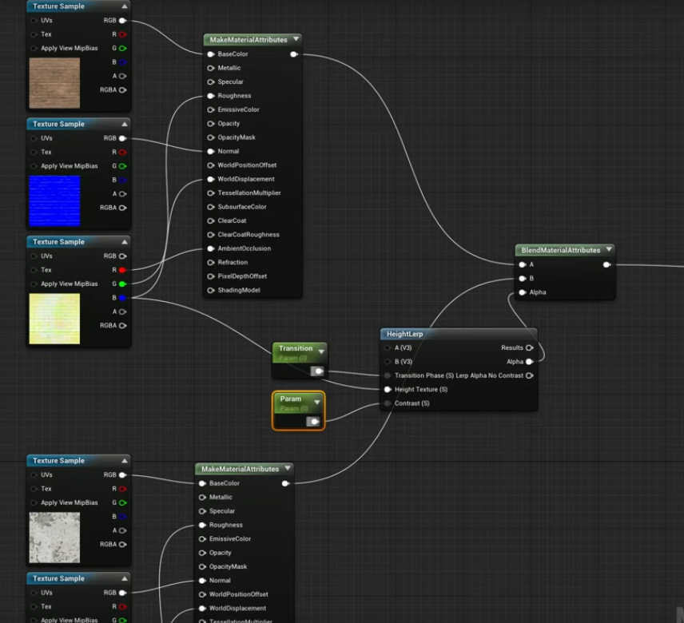
- instead of transition you can put vertex color and it will switch between 2 materials
## Hard
- the edge between 2 materials is pretty simple, you can add a function to make it random
- create a material function
- noise texture is called macro variation
- 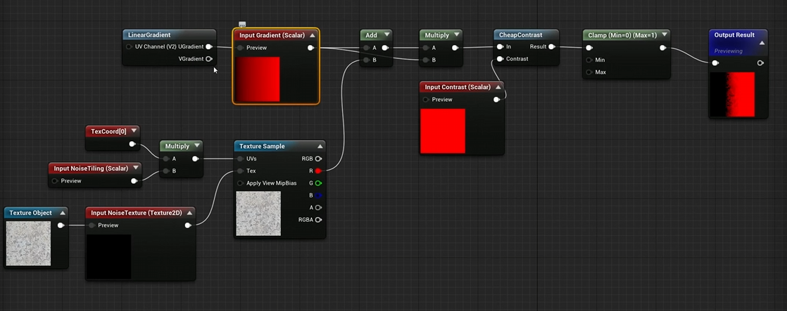
- that's how to connect it to the previous thing
- 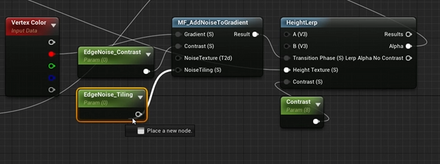
## Nanite
- Source
      * 
# Errors
- Opacity and virtual texture - disable virtual texture streaming in texture properties, switch to color sampler type