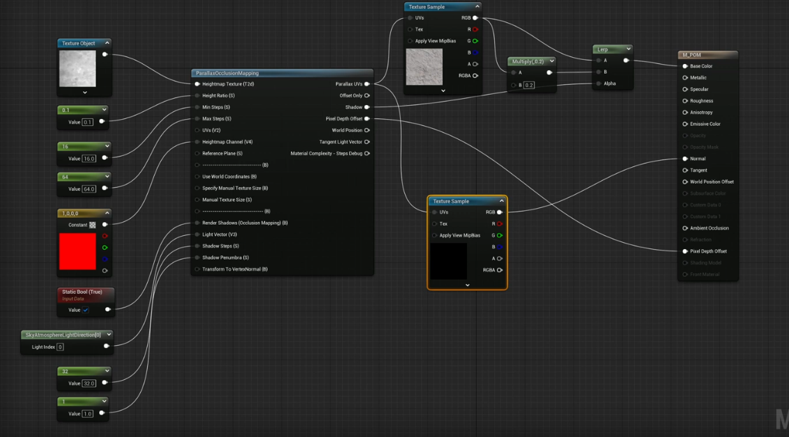

  * 
  * Parameters
    * Convert your texture sample to texture object by right click
    * Height Ratio is the height of parallax
    * Steps are 8 and 32 by default, increase if mesh looks bad
    * UVs - plug in your tiling or offset
    * Heightmap channel is which channel to use (vector 4)  - put it to red
    * Render shadows set to true with boolean
    * Light vector use skyatmospherelightdirection
    * Shadow steps 32
    * Shadow penumbra - shadow softness
    * Shadow on the right needs to be multiplied on top of diffuse or through lerp
    * Pixeldepth needs to disable shadows on your mesh
  * Source
    * 