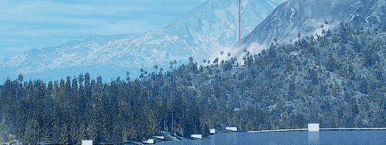
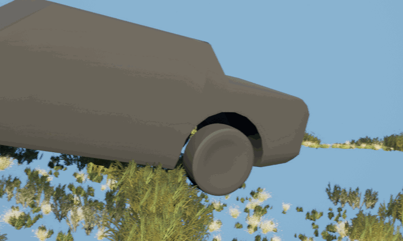
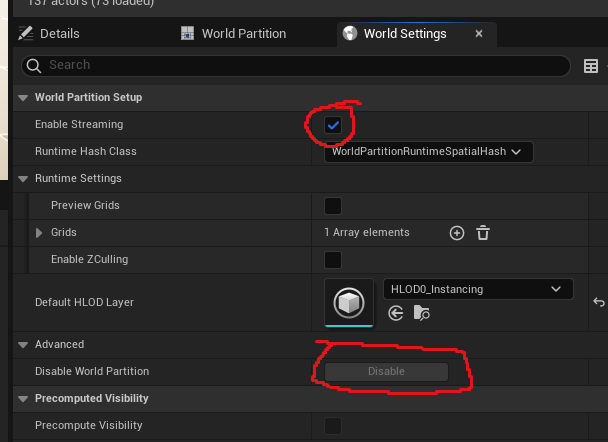
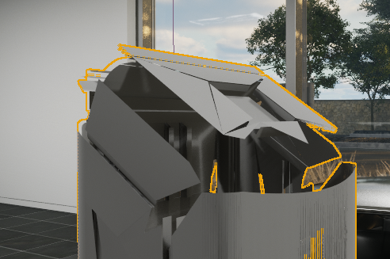
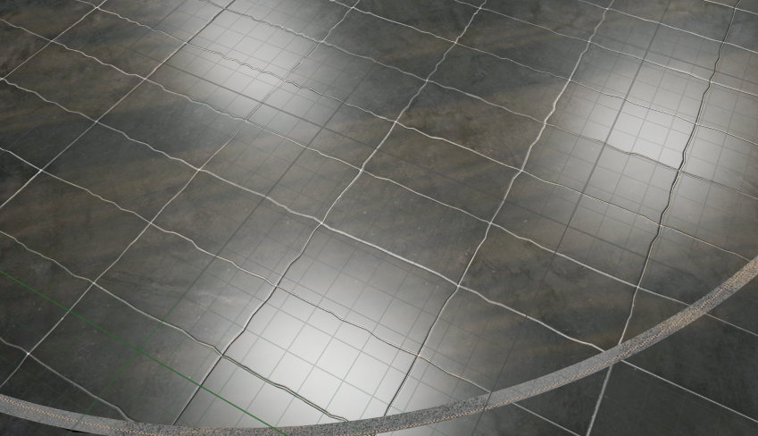
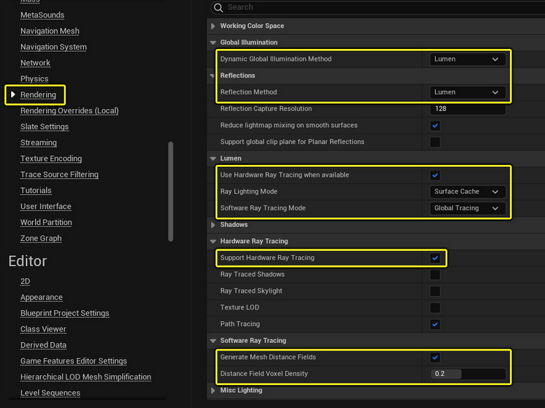
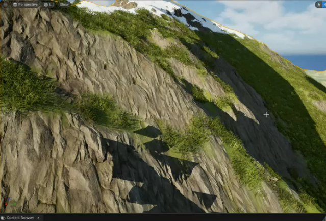
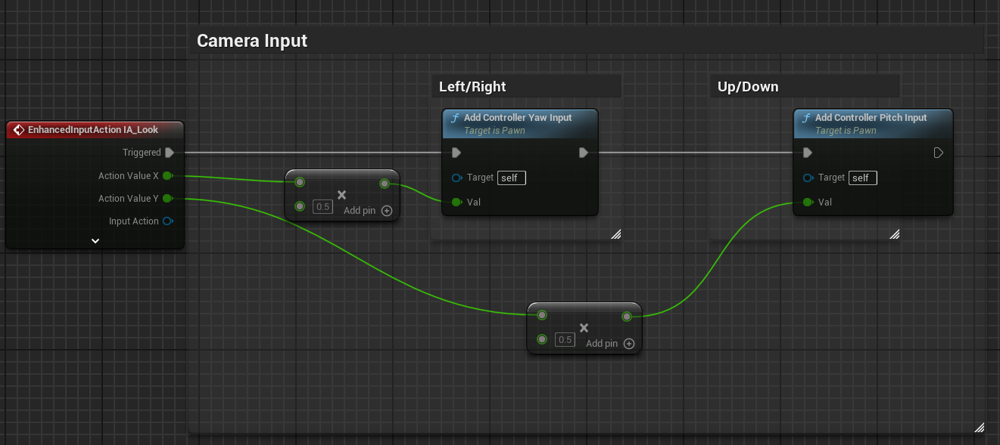
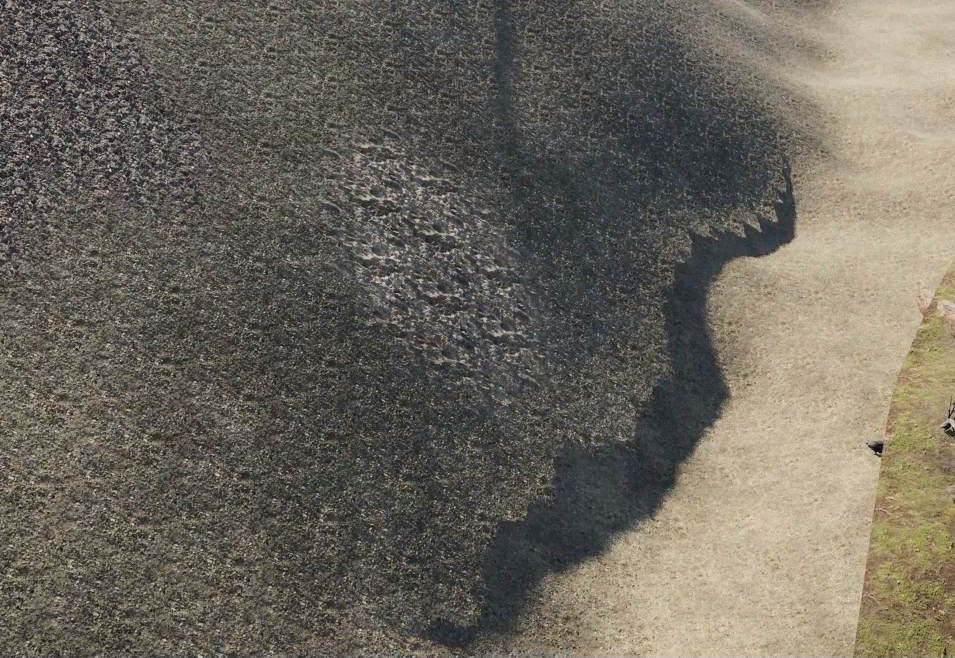

  * # General
    * **Bad size**
when player can't start cause of bad size it means it is probably intersecting with collision mesh
    * **Collision**
when you build an arch and can't pass through it, open the mesh settings
* change lit to colission
* find collision section on the right
* collision complexity - use complex collisions as simple
    * **Actors unloaded in level**
      * right click and pin
  * # PCG
    * **Lumen raytracing is being culled at big distances **

set r.RayTracing.Culling 0
    * **PCG trees look black at big distances**

disable raytraced shadow in light properties
      * assets://E%3A/Projects/Logseq/assets/lumen_shadows_02_1728906561310_0.gif
    * **PCG trees get culled at big distances**

enable preserve area under nanite settings for static mesh
    * **Slow PCG animation**
Unreal will recalculate a new collision mesh every frame, to disable 
it you need to set every static mesh collision type to NoCollision (keep
in mind that it updates every time you recalculate PCG)
If the performance is still low you can try disabling AO distance fields r.AOGlobalDistanceField 0
  * # Meshes
    * ## Meshes disappear based on camera angle
      * 
      * go to actor or mesh setting and increases bounds scale
this happens because the pivot of the mesh is very far away and UE get confused if you are looking at it or not so this parameter will increase the bounding box which determines camera position (looking)
      * check LOD in static mesh and material
    * ## Delete the starter landscape
* “World Settings” and uncheck “Enable Streaming”
* then the button “Disable” under “Disable World Partition” will be available.
* Click on that and you are done.

    * ## Actors unloaded in level
* right click and pin
    * ## Broken geometry on import

* disable "remove degenerates" on import
  * # Materials
    * ## Wobbly materials
      * 
      * enable high precision.... in SM editor
      * enable precise UVs
      * # have to click apply
    * ## HSL
  * # Rendering / lighting
    * ## No shadows from some meshes
      * In actor static mesh options "Evaluate World Position Offset in Ray Tracing"
    * ## Lumen reflection problem
      * 
* Disable high quality translucency reflections in post processing volume
    * ## Whole scene is completely white
      * go to post processing settings and exposure, set min and max brightness to default value
    * ## Lumen not working
      * Lumen doesn't render when scalability is set to Medium or lower.

    * ## Disable baked lights
      * Window - ‘World Settings’ tab called “Force No Precomputted Lighting.” This deactivates Lightmass’ ability to produce light and shadowmaps, forcing the level to only use dynamic lighting.
    * ## Render output blurry
      * check focus plane
    * ## When rendering camera is in wrong position
      * add camera cuts
    * ## Triangle shadows
      * 
      * Build - precompute static visibility
  * # Editor
    * ## Mouse too fast when playing the scene
      * * play the scene
* shift + 1 to release cursor
* press pause, in the outliner find BP_first_person_character and edit it
* add a multiply on x and y

  * # Errors
    * ## Render core and render graph definitions error on UE startup
delete DefaultEngine.ini
  * # Landscape
    * ## Weird shadows
      * 
      * enable forward shading
    * ## Delete the starter landscape
      * * “World Settings” and uncheck “Enable Streaming”
* then the button “Disable” under “Disable World Partition” will be available.
* Click on that and you are done.

  * # Shadows
    * Shadows disappear at certain camera distance
      * 
      * When you’re **not using Virtual Shadow Maps**, UE5 falls back to **Cascaded Shadow Maps (CSM)** for your directional light.
      * CSM uses a few cascades (usually 3–4) to cover a certain distance from the camera. Beyond that distance, **shadows stop being rendered**.
      * That distance is set by **Dynamic Shadow Distance**. If it’s, say, 10,000 units, then after 10m grass no longer receives per-object shadows → looks flat, no AO.
      * ## Set Dynamic Shadow Distance to 1-100
      * ---
      * 
      * change contact shadow length in settings to 0.01