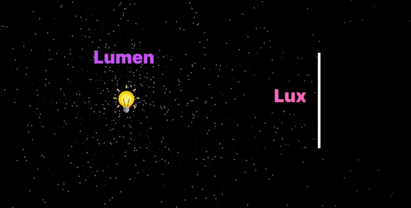
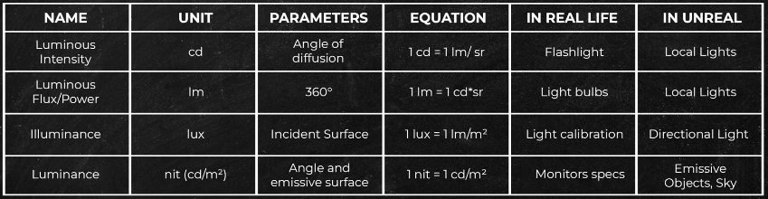
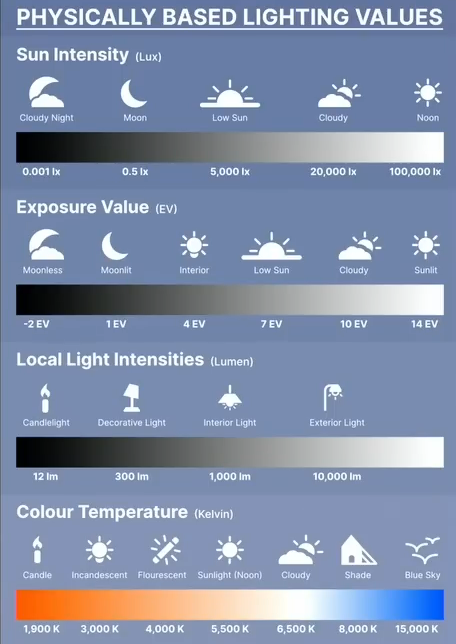
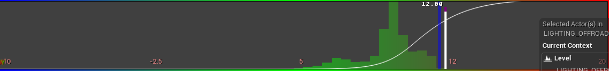
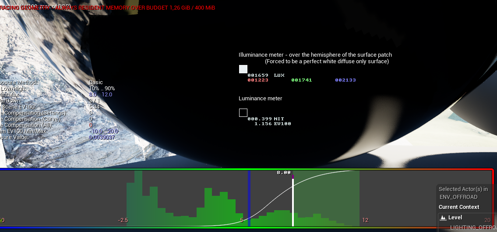

# Terms
- lux
      
- if the sun is 10 lux that means a perfect white surface will emit 10 lux back
    candella
      
# HowTO
- Use Visualize - HDR eye adaptation
- you can find color calibrator (macbeth) under engine - content - editor meshes - colorcalibrator - SM_ColorCalibrator
- enable **extend default luminance range in auto exposure*in project settings
- all trees need to have **two sided static mesh distance fields*enabled\
# Lighting values
- 
- 
- set sun to proper lux value
- The graph has to be between 5 and 12
- 
- if you have values like this (2 areas with columns) then something is clipping into darkness on the left
- 
- adjust shadow brightness in skylight with intensity scale
- if you go to your color calibrator and find the darkest spot you will see how much is clipping, so in this example to see all this information you need to set minEV to -2.5
- 
# Post process volume
## Auto exposure basic
	- exposure compensation 0
	- Tone mapper (we've taken the picture and now developing the negative)
		- toe is flattening the curve
		- shoulder contrast?
		- adjust local exposure of needed
## Apply Physical Camera Exposure
	- When enabled:
		- Uses *real-world camera parameters(Aperture, Shutter Speed, ISO).
		- Engine calculates brightness via **EV100*(Exposure Value at ISO 100).
		- Matches real photography workflows and physically-based lighting.
	- When disabled:
		- Exposure is controlled only by Post Process settings (Min/Max EV100, Metering Mode, Exposure Compensation).
		- Aperture/ISO/Shutter do **not*affect scene brightness.
## EV100 (Exposure Value at ISO 100)
	- Formula:
		- ```EV100 = log2(N² / t)```
		- N = f-number (aperture)
		- t = shutter time (seconds)
	- ISO is always normalized to 100.
	- Interpretation:
		- Higher EV100 = darker exposure (small aperture, fast shutter).
		- Lower EV100 = brighter exposure (wide aperture, slow shutter).
	- Practical ranges:
		- EV 0–5 → Night scenes (candles, moonlight).
		- EV 10–13 → Indoors, cloudy day.
		- EV 15–16 → Bright daylight.
	- Example:
		- f/11, 1/125s, ISO 100 → EV100 ≈ 15 (daylight).
# 🔆 HDR Adaptation Graph
	- What it shows: how Unreal adjusts exposure
	- **X-axis (horizontal):*brightness levels (dark → bright).
	- **Y-axis (vertical):*how many pixels are that bright.
	- Same with the tiny numbers blue is black, green is grey, red is highlights
	- The vertical green bars show how much of what you see in viewport right now 
	- The faint horizontal green area is the adaptation window (min and max ev)
  **Tips**
    Use *Apply Physical Camera Exposure = ONif you want real-world realism or to match reference photography.
    Use *OFFif you want direct control through Post Process Volume only.
    Cheat-sheet:  
      EV 2 → candlelight
      EV 8 → office lighting
      EV 12 → overcast outdoors
      EV 15 → sunny outdoors
  Sources
    https://www.youtube.com/watch?v=nlbJwMoj1Dg
    https://www.youtube.com/watch?v=oRJYQfOhhrw